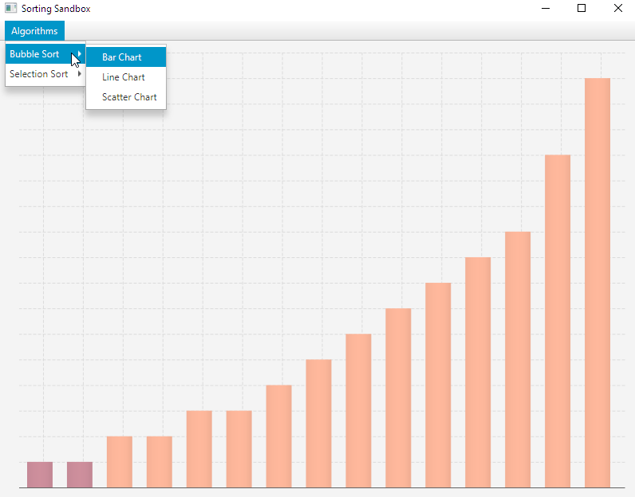

# Sorting Sandbox

## Java sandbox to implement, visualise and test/play with sorting algorithms.

## How to Run

1. Clone the repo
2. Run: `./gradlew run`

## Dev Info
1. To add a new algorithm to the mix impl the `SortingAlgorithm` interface in the algorithms package
2. Update Algorithm enum
3. Update AlgorithmFactory to return your new implementation
4. Enjoy!

